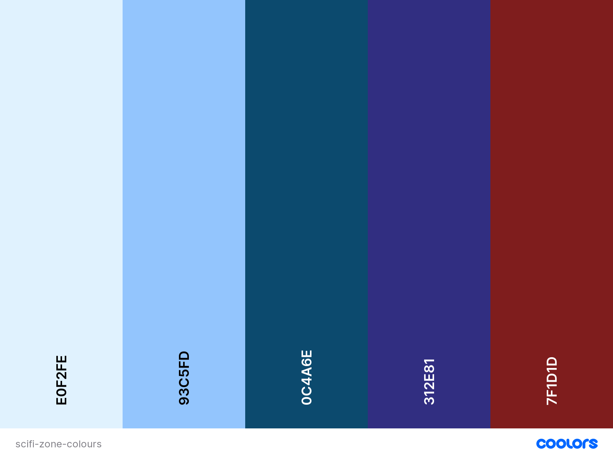
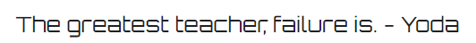
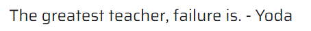

# **Sci-Fi-Zone**

## **About**

Full Stack Frameworks Milestone Project for Code Institute's Diploma in Software Development

Sci-Fi-Zone offers various tickets for a fictional science-fiction themed convention. Users browsing the site can see which actors will attend the convention, when and where the convention will take place, and which type of tickets are available. Users can put the various tickets into their shopping bag, edit the contents of their shopping bag, create a profile to save their address data and access their order history, and buy the tickets through secure checkout.

![Mockup]ADD MOCKUP!!!

## **Deployed project**

The deployed project can be found [here](https://ms4-scifi-zone.herokuapp.com/).

## **User Experience**

---

---

### **User stories:**

---

#### **Viewing and Navigation**

-   01: As a site user, I want to be able to view a list of tickets, so that I can see the price range.
-   02: As a site user, I want to be able to view a specific category of tickets, so that I can quickly find what I'm looking for.
-   03: As a site user, I want to be able to view details about the different tickets, so that I can compare them and decide which one best suits my interests.

#### **Registration and User Accounts**

-   04: As a shopper, I want to be able to easily register an account, so that I can view my profile.
-   05: As a shopper, I want to be able to receive an email confirmation after registration, so that I can verify that my account registration was successful.
-   06: As a shopper, I want to be able to have a personalized user profile, so that I can view my personal order history, order confirmations and tickets, and save my address information,
-   07: As a shopper, I want to be able to recover my password in case I forget it, so that I can recover access to my account.

#### **Sorting and Searching**

-   08: As a site user, I want to be able to sort specific categories of tickets, so that I can easily find tickets within an acceptable price range for me.
-   09: As a site user, I want to be able to search for a ticket by category or name of the actor, so that I can easily find autographs and/or photo shoots with my favourite actors.

#### **Purchasing and Checkout**

-   10: As a shopper, I want to be able to view tickets in my bag to be purchased, so that I can identify the total cost of my purchase and the number of tickets I bought.
-   11: As a shopper, I want to be able to adjust the number of each ticket in my bag, so that I can easily make changes to my purchase before checkout.
-   12: As a shopper, I want to be able to easily enter my payment information, so that I can check out quickly.
-   13: As a shopper, I want to be able to feel my personal and payment information is safe and secure, so that I can confidently provide the needed information to make a purchase.
-   14: As a shopper, I want to be able to view an order summary before I confirm my purchase, so that I can verify that I haven't made any mistakes.
-   15: As a shopper, I want to be able to receive an email confirmation after checkout, so that I can keep the confirmation of my purchase for my records.

#### **Admin and Site Management**

-   16: As a site owner, I want to be able to add a ticket and/or a ticket category, so that I can offer new tickets to customers.
-   17: As a site owner, I want to be able to edit/update a ticket, so that I can change various ticket criteria.
-   18: As a site owner, I want to be able to delete a ticket, so that I can remove tickets that are no longer for sale.

### **Design**

---

#### **Colour Scheme**

The beneath colour palette was used to set the theme and also provide good contrast for accessibility.

#### **Typography**

To match the science fiction theme of the site, [Orbitron](https://fonts.google.com/specimen/Orbitron?category=Serif,Sans+Serif,Display,Monospace#standard-styles) with its bold geometric forms was chosen for all headings.

For all other text, [Saira](https://fonts.google.com/specimen/Saira?category=Serif,Sans+Serif,Display,Monospace#standard-styles) was chosen to present a nice contrast while maintaining high readability.

#### **Icons**

All icons on the pages are from [Font Awesome](https://fontawesome.com). Links that have been styled to look like buttons don't include icons, because Bulma currently doesn't provide the possibility to adjust the position of the icons. Therefore, icons have been used only sparingly on all pages.

#### **Imagery**

Actor images were obtained from [Wikimedia](https://commons.wikimedia.org/w/index.php?search=&title=Special:MediaSearch&type=image). A [SOURCE.md](https://docs.google.com/spreadsheets/d/1rQUjvQ1QUJXCy0xjzFvaGLI8nwJdJbU3G1KA6ERHgbY/edit#gid=0) was created containing information about the image author, license + attribution, an image description and the URLs both for the image file and the image page. The images were then uploaded to [Cloudinary](https://cloudinary.com/) and transformed. The transformation includes changing the resolution, changing the format depending on the used browser, and adding image credit. For this purpose, several transformations had to be created to apply the correct image credit to each image.

Images used on the tickets and packages pages were obtained from [Freepik](https://www.freepik.com/home). Credit for each image is given below in the media section.

### **Wireframes**

---

I used Balsamiq to plan the site’s layout for different viewports (mobile and tablet). To better demonstrate the differences, I sort my wireframes by page and show both versions next to each other.
All wireframes for this project can be found in the [project's wiki wireframes sub-directory](https://github.com/Ryagg/scifi_zone/wiki/wireframes/).

### **Database Schema**

---

To be added

## **Features**

---

---

### **Existing Features**

---

#### **Features on all pages: navbar**

The navigation menu is fixed to the top to allow the user quick and easy navigation through the site. To declutter the navbar, drop-down menus are used for event information not found on the homepage, ticket information, account actions, and admin actions.
The available navigation menu items depend on whether a user is logged in, and for some options also on whether a user is an admin:

| Nav Link           | Not logged in | Logged in as user | Logged in as admin |
| :----------------- | :------------ | :---------------- | :----------------- |
| Logo(back to home) | &#9989;       | &#9989;           | &#9989;            |
| Event info         | &#9989;       | &#9989;           | &#9989;            |
| Ticket info        | &#9989;       | &#9989;           | &#9989;            |
| Bag                | &#9989;       | &#9989;           | &#9989;            |
| My Account         | &#9989;       | &#9989;           | &#9989;            |
| Register           | &#9989;       | &#10060;          | &#10060;           |
| Log In             | &#9989;       | &#10060;          | &#10060;           |
| My Profile         | &#10060;      | &#9989;           | &#9989;            |
| Admin              | &#10060;      | &#10060;          | &#9989;            |
| Add Guest          | &#10060;      | &#10060;          | &#9989;            |
| Edit Guest         | &#10060;      | &#10060;          | &#9989;            |
| Remove Guest       | &#10060;      | &#10060;          | &#9989;            |
| Log Out            | &#10060;      | &#9989;           | &#9989;            |
| Copyright          | &#9989;       | &#9989;           | &#9989;            |
| Contact            | &#9989;       | &#9989;           | &#9989;            |

#### **Features on all pages: footer**

The footer is located at the bottom of each page and includes links to reach the website author on social media, the site notice, and the privacy policy. The links open in a new browser tab.

#### **Home page: event info with CTA**

The homepage consists of three sections informing the user about the site's aim, highlighting the guests at the event, and informing users about the event's opening times. It also includes a CTA in the form of a prominent link to the tickets page, and features a science fiction themed background image.

#### **Guests page features**

The guests page provides an overview of all guests attending the event, and informs the user that more information can be found on each guest's detail page. Admins can edit the guest info and remove the guest from the convention via buttons that are only displayed for admins.

#### **Guests detail page features**

The detail page for each guest contains a paragraph with general information about the guest, and links to the guest's pages on IMDB, Wikipedia, and the guest's own homepage (if there is one). A second paragraph provides the appearance info for the guest. Due to time constraints, and also as is usual for similar events, detailed information is not provided until about 6 weeks before the event.
The page also informs the user how much an autograph from and a photoshoot with the actor will cost. Currently, the buttons only link to the corresponding ticket page, instead of directly adding the ticket to the shopping bag. At the bottom of the page, a disclaimer informs the user that these tickets are only valid in combination with a standard ticket or a package, and that guest appearance can't be guaranteed, and that a credit refund voucher will be provided if the guest does not appear at the event. Admins can edit the guest info and remove the guest from the convention via buttons that are only displayed for admins.

#### **Tickets and packages page features**

Both the tickets and packages page contain an image and a short paragraph with general information about the products. All available products are listed with their price and a link to the product's detail page. At the bottom of the page, links to the opposite product are provided.

#### **Tickets and packages detail page features**

The detail pages for tickets and packages contain a description of the product, a list of included items, and give users the opportunity to add the product to their shopping bag. In case of autograph and photoshoot tickets, radio elements listing all guests in the selected price category let users choose the guest they want an autograph from or photoshoot with. A prominent paragraph again informs the user that these tickets are only valid in combination with standard tickets or packages. For addon-tickets, a link back to the tickets page is provided.

#### **Bag page features**

If the user hasn't added any tickets, he is informed the shopping bag is empty and a link to the tickets page is provided.

If there are items in the bag, an overview with the number of items, price, included VAT and grand total is displayed. Users can follow a link to the checkout page. Additionally, users can update the quantity of each item in the back, remove selected items from the bag, or remove all items from the shopping bag. A link back to the tickets page is provided.

#### **Checkout page features**

The checkout page is only accessible if there are items in the shopping bag. Otherwise, users will be redirected to the tickets page, and an error message informs them that the shopping bag is empty. If users come from their shopping bag page, an order summary is presented and the grand total prominently displayed. To proceed, users must fill out a form with their billing address. Users can save this information to their profile. The form will then be prefilled with this information for future purchases. Payment is handled through a stripe card element on the page.

#### **Checkout success page features**

Order information with order number and order date, order details with product name, quantity, and price, as well as the billing information with the grand total are displayed.

#### **Register page features**

Users must provide and confirm their e-mail address and password. They also have to provide a username. The sign up button registers the user to the database. For users who are already registered, a sign-in link is provided.

#### **Login page features**

The login page contains fields for users to enter their username or email and password, and a "Sign in" button. Users can activate the "Remember Me" functionality. Links to the homepage and to the password reset page are displayed.

#### **Profile page features**

For a newly registered user who hasn't purchased anything yet, the profile page displays a form where the billing address can be provided. The order history will display a message that no tickets have been ordered yet, and display a link to the tickets page.

For users who already purchased products, the form with the billing address will be prefilled. Users can update this information. The order history displays detailed information for each order and item in an order.

#### **Admin-actions page features**

Admins can add new guests to the event. A form with fields taken from the correspondent model is displayed. If the form is valid and submitted, the new guest will be added to the database, and the homepage, guests page and guest detail page are updated. The cancel-button takes the admin back to the guests page.

#### **Logout page features**

The logout page features a confirmation dialogue before the user is logged out and the session cleared.

#### **CONTACT page features**

NOT YET IMPLEMENTED

#### **General Data Protection Regulation compliance**

The site features both a site notice and a privacy policy. Both pages can be reached through links in the footer. A paid subscription has been bought at [e-recht24.de](https://www.e-recht24.de/) to ensure compliance with all applicable regulations.

### **Features to be implemented**

---

-   A Frequently Asked Questions page
-   A contact page

### ** Removed Features / Features chosen not to be implemented**

---

-   Copyright page: Image credit is given in the readme, and for actor images also at the bottom of each image and the separate SOURCES.md. A separate copyright page is not needed.
-   Search function: a search function for tickets and packages was implemented, but due to the current structure of the project, it did not entirely work as intended. While the search generated the correct results, the detailed view for packages either used the wrong template or generated errors. Several attempts to fix this were unsuccessful, and it was decided to remove the feature instead of making changes to several apps to include it. With 9 tickets and 4 packages, the number of available products is small enough to be viewed on the correspondent page without losing track.

## **Technologies Used**

---

---

### **Languages**

---

-   [HTML5](https://developer.mozilla.org/en-US/docs/Web/Guide/HTML/HTML5)
-   [CSS3](https://developer.mozilla.org/en-US/docs/Web/CSS)
-   [Python](https://www.python.org/)
-   [JavaScript](https://developer.mozilla.org/en-US/docs/Web/JavaScript)

### **Libraries & Frameworks**

---

-   [Bulma](https://bulma.io/)

    CSS framework to build responsive web sites

-   [Django](https://www.djangoproject.com/)

    Python framework for the project

-   [Jinja](https://jinja.palletsprojects.com/en/3.0.x/)

    Templating engine for the project

-   [Font Awesome](https://fontawesome.com/)

    All icons are from Font Awesome

### **Tools**

---

-   [VSCode](https://code.visualstudio.com/)

    IDE used for coding

-   [GitHub](https://github.com/)

    Used to store the source code for this project

-   [Heroku](https://www.heroku.com/)

    Used to deploy and host the live website

-   [AWS](https://aws.amazon.com/)

    Used to host static files

-   [Django-CSP](https://django-csp.readthedocs.io/en/latest/installation.html)

    Used to add and configure a content-security-policy

-   [Django-crispy-forms](https://django-crispy-forms.readthedocs.io/en/latest/install.html#installing-django-crispy-forms)

    used to render forms

-   [Pytest-Django](https://github.com/pytest-dev/pytest-django)

    Used for automated tests with [Pytest](https://docs.pytest.org/en/7.0.x/)

-   [Google Chrome Developer Tools](https://developer.chrome.com/docs/devtools/)

    Used to check the styling, colour contrast and responsiveness of the site

-   [Sizzy](https://sizzy.co/)

    Used to check the responsiveness of the site by comparing various viewports next to each other

-   [Balsamiq](https://balsamiq.com/)

    Used to create the wireframes

-   [Coolors colour palette generator](https://coolors.co/)

    Used to create the colour palette

-   [W3C HTML Validation Service](https://validator.w3.org/)

    HTML Validator

-   [W3C CSS Validation Service](https://jigsaw.w3.org/css-validator/)

    CSS Validator

-   [JSHint](https://jshint.com)

    JS validator

-   [TinyJPG](https://tinyjpg.com/)

    Used to optimize images

## **Testing**

---

---

Please refer to the separate [TESTING.md](TESTING.md) for all forms of testing and the documentation of bugs.

### **Forking**

---

If you wish to use this repository as a starting point or to propose changes to this project, you can fork it. Follow the steps below.

1. Navigate to the repository [Ryagg/scifi_zone](https://github.com/Ryagg/scifi_zone)
2. Click 'Fork' in the top-right corner.

### **Cloning**

---

Cloning a repository creates a local copy on your computer. Follow the steps below.

1. Navigate to the repository [Ryagg/scifi_zone](https://github.com/Ryagg/)
2. Click 'Code' above the list of files.
3. In the new window, cloning using HTTPS is the default option. Copy the provided link manually or by clicking on the clipboard symbol.
4. Open Git Bash.
5. Navigate to your desired directory for the cloned project.
6. Type git `clone https://github.com/Ryagg/scifi_zone.git` or paste the copied address from step 3.
7. Press **Enter** to create your local clone.

Alternatively, if using Gitpod, you can click below to create your own workspace using this repository.

### **Deploy remotely**

---

To deploy the site remotely on [Heroku](https://www.heroku.com/) please follow the steps below.

1. Create either a **requirements.txt** file with `pip install -r requirements.txt` or a **Pipfile** with `pipenv sync` , if using pipenv, to enable Heroku to install the required dependencies for the app.
2. Create a **Procfile** with the content `web:gunicorn scifi_zone.wsgi:application`. Remove any blank lines at the end as they may cause errors.
3. Register a free Heroku account, if you don't have one already, sign in and create the app.
4. Select the **Deploy** tab and choose **Github** as **Deployment method**.
5. Select the **Settings** tab and click on **Reveal Config Vars** in the section **Config Vars**. Add the following variables:
    - SECRET_KEY: `<your secret key>`
    - DATABASE_URL: `<your Postgress db URL from Heroku>`
    - USE_AWS: True
    - AWS_ACCESS_KEY_ID: `<your AWS access key id, generated in the AWS console after user creation>`
    - AWS_SECRET_ACCESS_KEY: `<your secret AWS access key, generated in the AWS console after user creation>`
    - STRIPE_PUBLIC_KEY: `<your Stripe public key>`
    - STRIPE_SECRET_KEY: `<your Stripe secret key>`
    - STRIPE_WEBHOOK_KEY: `<your Stripe webhook key. Only necessary if using webhooks. This project currently does not use webhooks.>`
    - EMAIL_HOST_PASS: `<your project email password>`
    - EMAIL:HOST_USER: `<your project email address>`
    - DEVELOPMENT: False
        - Set this value to 'True' when updating the code.
        - **In any other case set it to 'False' or remove it to avoid remote code execution!**
6. Push the **Procfile** to your Github repo.
7. Back under the **Deploy** tab in Heroku enable **Automatic deploys**.
8. Select the **main branch** and click on **Deploy branch**.
9. Wait for the message 'Your app was successfully deployed' and then click **View** to start your app in the browser.

## **Credits**

---

---

### **Media**

---

The following photos were obtained from [Freepik](https://www.freepik.com/home).

#### **Tickets pages**

Stack of event tickets: Photo by [alfatwp](https://www.freepik.com/alfatwp) on [Freepik](https://www.freepik.com/premium-psd/event-ticket-mockup_5663633.htm#&position=3&from_view=undefined)

Fountain pen signing signature: Photo by [BillionPhotos](https://www.freepik.com/billionphotos) on [Freepik](https://www.freepik.com/premium-photo/signing-signature-with-classic-fountain-pen_17060832.htm#&position=5&from_view=undefined)

Women filming herself using a camera on a tripod: Photo by [frimufilms](https://www.freepik.com/frimufilms) on [Freepik](https://www.freepik.com/free-photo/young-content-creator-blonde-talking-gesturing-girl-filming-herself-using-camera-tripod_13843525.htm#&position=6&from_view=undefined)

#### **Packages pages**

4 falling down event tickets: Photo by [alfatwp](https://www.freepik.com/alfatwp) on [Freepik](https://www.freepik.com/premium-psd/event-ticket-mockup_5663630.htm#&position=0&from_view=undefined)

#### **Homepage and guest pages**

Actor images obtained from [Wikimedia](https://commons.wikimedia.org/wiki/Main_Page):

Please refer to the separate [SOURCES.md](https://docs.google.com/spreadsheets/d/1rQUjvQ1QUJXCy0xjzFvaGLI8nwJdJbU3G1KA6ERHgbY/edit?usp=sharing) for sources, licenses and attribution for each image.

### **Code**

---

All code not written by me has the source for the code added as comment above the relevant code. For longer pieces of code the credit is repeated beneath.

-   The Python/Django and Javascript code from Code Institute's [Boutique Ado walkthrough](https://github.com/Code-Institute-Solutions/boutique_ado_v1) was used as a groundwork for this project.
-   Sticky footer for Bulma: https://gehrcke.de/2020/03/bulma-sticky-footer-flexbox-solution/

### **Websites and Documentation**

---

-   [Bulma docs](https://bulma.io/documentation/)
-   [Django docs](https://docs.djangoproject.com/en/3.2/)
-   [Django-CSP docs](https://django-csp.readthedocs.io/en/latest/index.html)
-   [Django-crispy-forms docs](https://django-crispy-forms.readthedocs.io/en/latest/index.html)
-   [Pytest-Dango docs](https://pytest-django.readthedocs.io/en/latest/)
-   [Stackoverflow](https://stackoverflow.com/)
-   [CSS-tricks](https://css-tricks.com/)

### **Acknowledgements**

---

Many thanks to:

-   My mentor, Tim Nelson, for his truly outstanding support and advice.
-   The tutors from Code Institute for their guidance. Special shout-out to Scott_ci: You rock!
-   The always helpful and supportive CI slack community.
