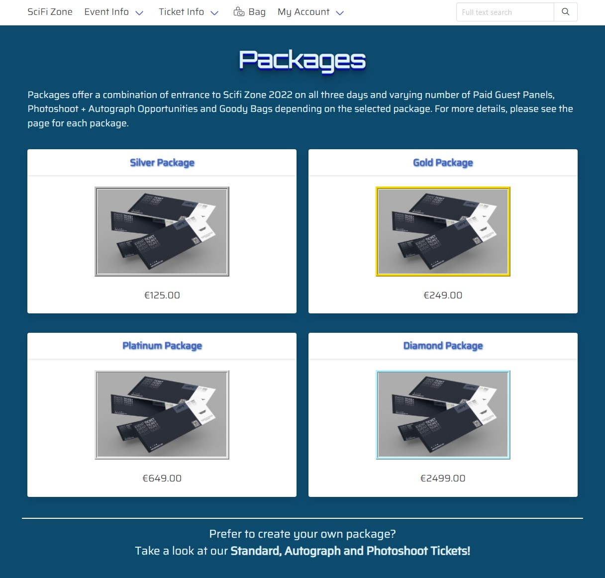
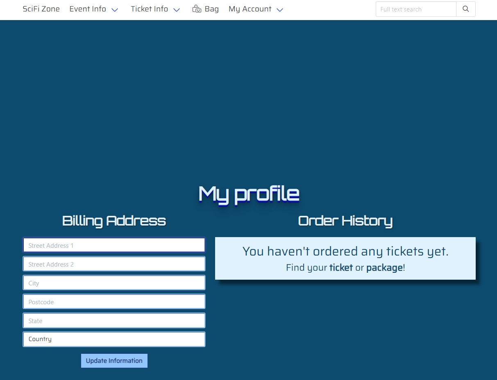
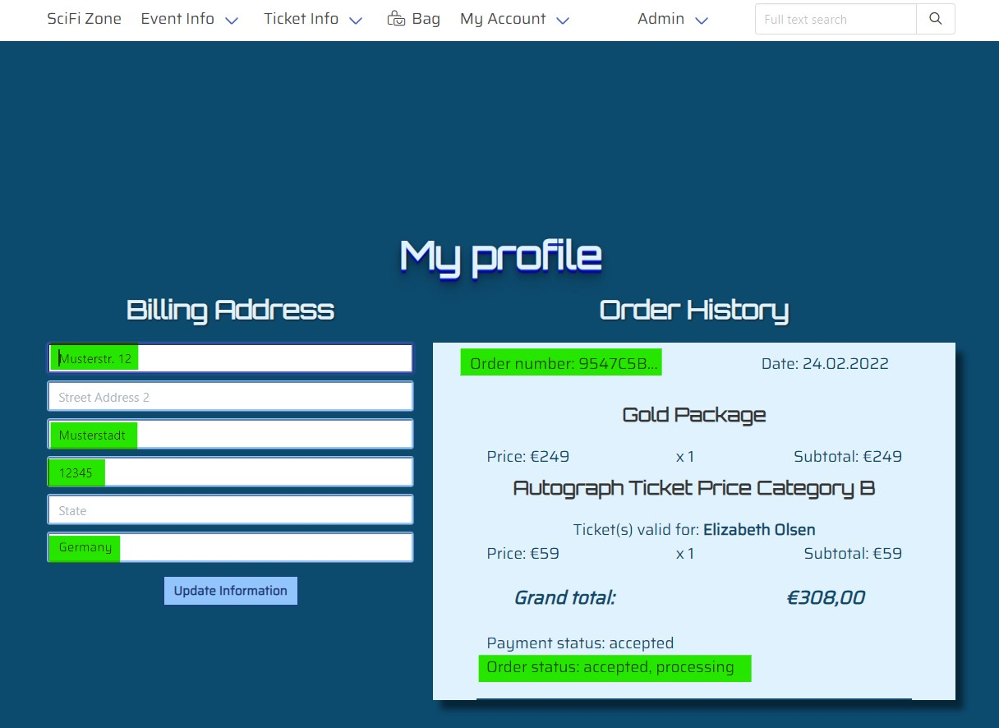
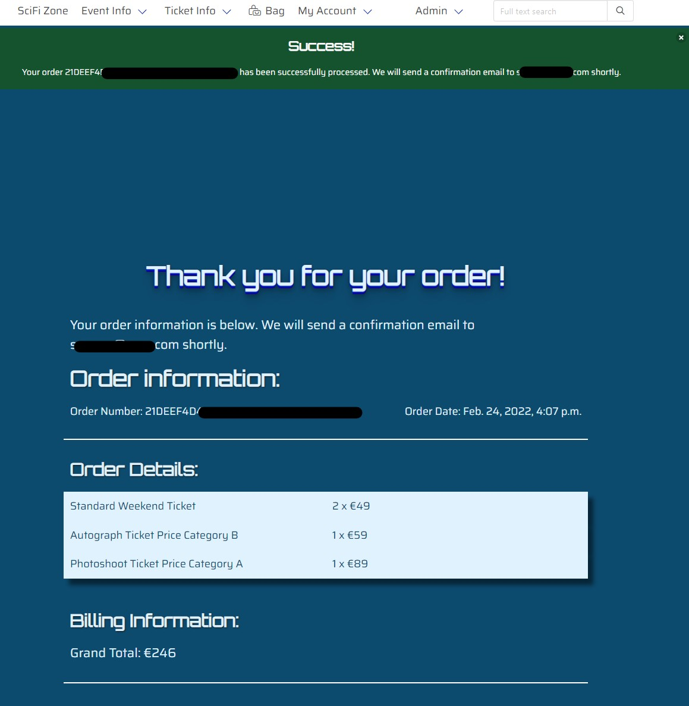

## **Testing User Stories**

### **User Requirements and Expectations**

The following user requirements and expectations were developed based on the user stories.

#### **Expectation 1: being able to view a list of tickets**

-   Requirement: allow users to easily access an overview of available tickets
-   Implementation: both the page for all tickets and the page for all packages can be accessed through the navbar. The sticky navbar at the top of the page furthermore facilitates easy navigation. See the screenshots [here](documentation/testing/usertests/user-expectation-1.jpg), [here](documentation/testing/usertests/user-expectation-1-example-2.jpg), and [here](documentation/testing/usertests/user-expectation-1-example-3.jpg).

#### **Expectation 2: being able to see a specific category of tickets**

-   Requirement: allow users to filter for ticket categories
-   Implementation: an implemented search function for tickets has been removed. Please refer to the Removed Features / Features chosen not to be implemented section for details. Only tickets have categories, and all tickets within a category can be viewed at the [tickets page](documentation/testing/usertests/user-expectation-1-example-2.jpg).

#### **Expectation 3: being able to see details about the tickets**

-   Requirement: give users detailed information about each ticket
-   Implementation: Views with detailed information about each ticket for each category were created. See examples [here](documentation/testing/usertests/user-expectation-3.jpg), [here](documentation/testing/usertests/user-expectation-3-example-2.jpg), and [here](documentation/testing/usertests/user-expectation-3-example-3.jpg).

#### **Expectation 4: Being able to easily register an account and view the profile**

-   Requirement: Allow users to register an account and attach a profile
-   Implementation: For the registration, the built-in Django functionality was used. A profile app was created to store relevant information and display it on the user's profile page. See the profile for a new user [here](documentation/testing/usertests/user-expectation-4.jpg)

#### **Expectation 5: Being able to verify the account registration was successful**

-   Requirement: Notify users about the account creation
-   Implementation: The built-in Django functionality was used for user registration and e-mail confirmation. See an example of the confirmation email [here](documentation/testing/usertests/user-expectation-5.jpg)

#### **Expectation 6: being able to access a personalized user profile**

-   Requirement: Attach the order information to the user profile, display an order history on the profile page, and allow users to update their information.
-   Implementation: The checkout and profile views handle the business logic. The order history and billing address form are displayed on the [profile page](documentation/testing/usertests/user-expectation-6.jpg)

#### **Expectation 7: being able to recover the account password**

-   Requirement: Allow users to reset their password and verify that the user is the account owner.
-   Implementation: The built-in Django functionality was used for this feature. Therefore, only one exemplary screenshot can be found [here](documentation/testing/usertests/user-expectation-7.jpg) to show how the template was adapted to style the site's theme.

#### **Expectation 8: being able to sort specific categories of tickets**

-   Requirement: Add sort and direction parameters to corresponding views and the navbar.
-   Implementation: The maximum number of tickets per category is 3. Therefore, a sorting function would not add much to the user experience and has not been implemented.

#### **Expectation 9: being able to search for a ticket by category or actor name to easily find autograph or photoshoot tickets with selected actors**

-   Requirement: Implement a search function.
-   Implementation: as stated above for Expectation 2 and in the Removed Features / Features chosen not to be implemented section, the implemented search feature has been removed. Users can access an actor's detail page both from the [homepage](documentation/testing/usertests/user-expectation-9.jpg) and the guest page. On the [detail page](documentation/testing/usertests/user-expectation-9-example-2.jpg), links to buy photoshoot and autograph tickets are provided. Please note that the thin horizontal line between the actor image (with admin-only links) and the info box is not rendered on the real page, and only appears in the devtools view when resizing the page to 50%. Another way to find the autograph or photoshoot tickets with an actor is to view the [detail pages for the selected ticket category](). However, unless a user knows in which category the actor can be found, the user must view one, two, or all three categories before the actor is found.

#### **Expectation 10: being able to see detailed bag contents and total cost**

-   Requirement: Use bag tools and contexts to calculate the sub-total and VAT, update the bag content, if applicable, and make the contents available on all pages.
-   Implementation: Views and a template to display bag contents using bag tools and contexts were created to display the [shopping bag](documentation/testing/usertests/user-expectation-10.jpg) to the user.

#### **Expectation 11: being able to adjust the number of items in the bag before checkout**

-   Requirement: Same as above.
-   Implementation: The shopping bag display includes an input field where users can update the quantity for each item in the bag. See the screenshot [here](documentation/testing/usertests/user-expectation-11.jpg).

#### **Expectation 12: being able to easily enter payment information**

-   Requirement: Provide an intuitive way for users to enter their payment information
-   Implementation: the [Stripe card element](documentation/testing/usertests/user-expectation-12.jpg) was used for checkout and styled to match the site's theme.

#### **Expectation 13: being able to feel that the personal and payment information is safe and secure**

-   Requirement: Using Django middleware and additional tools like Django-CSP and Django-CORS to make the site as secure as possible. Using Stripe to handle payments, so that the user's payment information never touches the application's server.
-   Implementation: see requirement.

ADD SETTINGS SCREENSHOT OR UPDATE REQUIREMENT INFO

#### **Expectation 14: being able to view an order summary before checkout**

-   Requirement: Use bag tools and contexts to calculate the sub-total, update the bag content, if applicable, and make the contents available on all pages.
-   Implementation: Views and a template to display bag contents using bag tools and contexts were created to display the order summary on the checkout page. See an example [here](documentation/testing/usertests/user-expectation-14.jpg).

#### **Expectation 15: receiving an email confirmation after checkout**

-   Requirement: Collect the user's email address, attach it to the order, and send a confirmation email after a successful checkout.
-   Implementation: The checkout view handles the business logic and generates an [order confirmation on screen](documentation/testing/usertests/user-expectation-15.jpg) after a successful checkout. The built-in Django functionality is used to send a [confirmation email](documentation/testing/usertests/user-expectation-15-example-2.jpg) to the user. Please note that the confirmation email and the confirmation on screen in the images do not match each other and were chosen for convenience.

#### **Expectations 16-18**

Please note that for the following three expectations, an adjustment has been made! The expectations cover CRUD functionality for tickets. During the development process, I realized that all kinds of tickets for convention events (entrance tickets, autograph and photoshoot tickets, and combinations of them) are already implemented. I therefore decided to allow admins to add, edit, and delete actors to/from the event instead.

#### **Expectation 16: being able as a site owner to add actors to the event**

-   Requirement: check whether the user has admin privileges, create a form from the corresponding model, and let the authorized user update the database with the data for the new actor.
-   Implementation: A corresponding form, view, url, template, and navbar-item were generated. The view has a login-required decorator and checks whether the user is also a superuser. The navbar-item is only visible for superusers. See these screenshots for the [form](documentation/testing/usertests/user-expectation-16.jpg), [detail page with confirmation dialogue](documentation/testing/usertests/user-expectation-16-example-2.jpg), and [updated guests page](documentation/testing/usertests/user-expectation-16-example-3.jpg).

#### **Expectation 17: being able as a site owner to edit an actor's information**

-   Requirement: similar to the above requirement. Provide a form, accessible only for superusers, to update the information and update the database.
-   Implementation: Links to the form to edit an actor's information are available for superusers both on the guests page and on the detail page for each guest. See screenshots [1](documentation/testing/usertests/user-expectation-17.jpg), [2](documentation/testing/usertests/user-expectation-17-example-2.jpg), [3](documentation/testing/usertests/user-expectation-17-example-3.jpg), and [4](documentation/testing/usertests/user-expectation-17-example-4.jpg).

#### **Expectation 18: being able as a site owner to remove an actor from the convention**

-   Requirement: access the corresponding object and remove it from the database
-   Implementation: Links to remove an actor were placed beneath the links to edit the actor's info. Superusers only can access the links. After the actor has been removed from the database, the admin is redirected to the [updated guests page](documentation/testing/usertests/user-expectation-18.jpg) and a confirmation message is displayed.

## **Functionality Testing**

---

---

## TO BE ADDED / SEE AUTOMATED TESTS

## **Validators**

---

---

### **W3C Markup Validator**

---

### **W3C CSS Validator**

---

### **WAVE Validator**

---

### **Lighthouse**

---

### **JShint**

---

### **Python**

---

## **Usability Testing**

---

---

## **Compatibility Testing**

---

---

## **Responsiveness**

---

---

## **Bugs**

---

---
