## **Testing User Stories**

### **User Requirements and Expectations**

The following user requirements and expectations were developed based on the user stories.

#### **Expectation 1: being able to view a list of tickets**

-   Requirement: allow users to easily access an overview of available tickets
-   Implementation: both the page for all tickets and the page for all packages can be accessed through the navbar. The sticky navbar at the top of the page furthermore facilitates easy navigation. See the screenshots [here](documentation/testing/usertests/user-expectation-1.jpg), [here](documentation/testing/usertests/user-expectation-1-example-2.jpg), and [here](documentation/testing/usertests/user-expectation-1-example-3.jpg).

#### **Expectation 2: being able to see a specific category of tickets**

-   Requirement: allow users to filter for ticket categories
-   Implementation: In addition to the navbar providing links to the tickets and packages pages and all tickets in each category being displayed there (see screenshots above), Django-Watson was used to implement full-text search across all relevant models.

#### **Expectation 3: being able to see details about the tickets**

-   Requirement: give users detailed information about each ticket
-   Implementation: Views with detailed information about each ticket for each category were created. See examples [here](documentation/testing/usertests/user-expectation-3.jpg), [here](documentation/testing/usertests/user-expectation-3-example-2.jpg), and [here](documentation/testing/usertests/user-expectation-3-example-3.jpg).

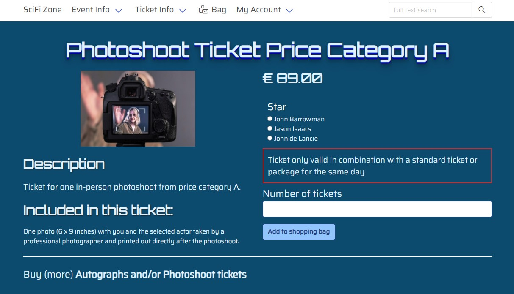

#### **Expectation 4: Being able to easily register an account and view the profile**

-   Requirement: Allow users to register an account and attach a profile
-   Implementation: For the registration, the built-in Django functionality was used. A profile app was created to store relevant information and display it on the user's profile page. See the profile for a new user [here](documentation/testing/usertests/user-expectation-4.jpg)

#### **Expectation 5: Being able to verify the account registration was successful**

-   Requirement: Notify users about the account creation
-   Implementation: The built-in Django functionality was used for user registration and e-mail confirmation. See an example of the confirmation email [here](documentation/testing/usertests/user-expectation-5.jpg)

#### **Expectation 6: being able to access a personalized user profile**

-   Requirement: Attach the order information to the user profile, display an order history on the profile page, and allow users to update their information.
-   Implementation: The checkout and profile views handle the business logic. The order history and billing address form are displayed on the [profile page](documentation/testing/usertests/user-expectation-6.jpg)

#### **Expectation 7: being able to recover the account password**

-   Requirement: Allow users to reset their password and verify that the user is the account owner.
-   Implementation: The built-in Django functionality was used for this feature. Therefore, only one exemplary screenshot can be found [here](documentation/testing/usertests/user-expectation-7.jpg) to show how the template was adapted to style the site's theme.

#### **Expectation 8: being able to sort specific categories of tickets**

-   Requirement: Add sort and direction parameters to corresponding views and the navbar.
-   Implementation: The maximum number of tickets per category is 3. Therefore, a sorting function would not add much to the user experience and has not been implemented.

#### **Expectation 9: being able to search for a ticket by category or actor name to easily find autograph or photoshoot tickets with selected actors**

-   Requirement: Implement a search function.
-   Implementation: Both tickets and actors can be found using the [search function](documentation/testing/usertests/user-expectation-9-example-4.jpg). The easiest way to find the autograph or photoshoot tickets with an actor is to view the detail pages for the [selected actor](documentation/testing/usertests/user-expectation-9-example-2.jpg). From there, autograph and photoshoot tickets can be added to the shopping bag. All actors in a price category can be viewed on the detail page for each [ticket category](documentation/testing/usertests/user-expectation-9-example-3.jpg).

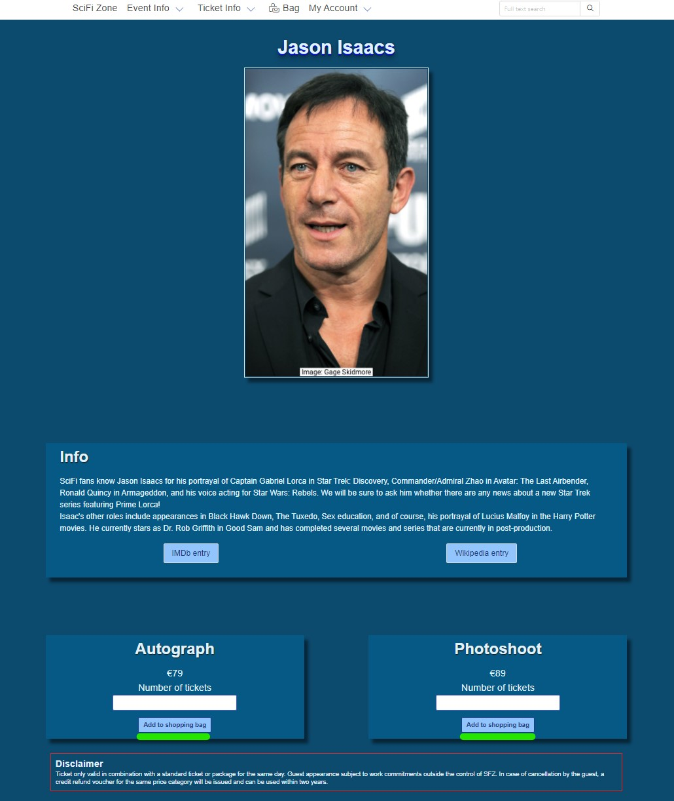
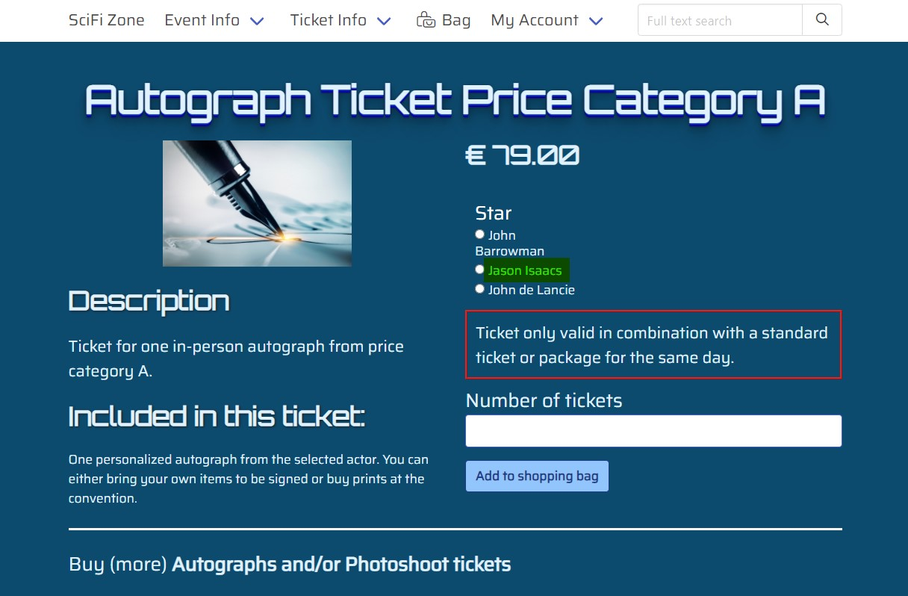

#### **Expectation 10: being able to see detailed bag contents and total cost**

-   Requirement: Use bag tools and contexts to calculate the sub-total and VAT, update the bag content, if applicable, and make the contents available on all pages.
-   Implementation: Views and a template to display bag contents using bag tools and contexts were created to display the [shopping bag](documentation/testing/usertests/user-expectation-10.jpg) to the user.

#### **Expectation 11: being able to adjust the number of items in the bag before checkout**

-   Requirement: Same as above.
-   Implementation: The shopping bag display includes an input field where users can update the quantity for each item in the bag. See the screenshot [here](documentation/testing/usertests/user-expectation-11.jpg).

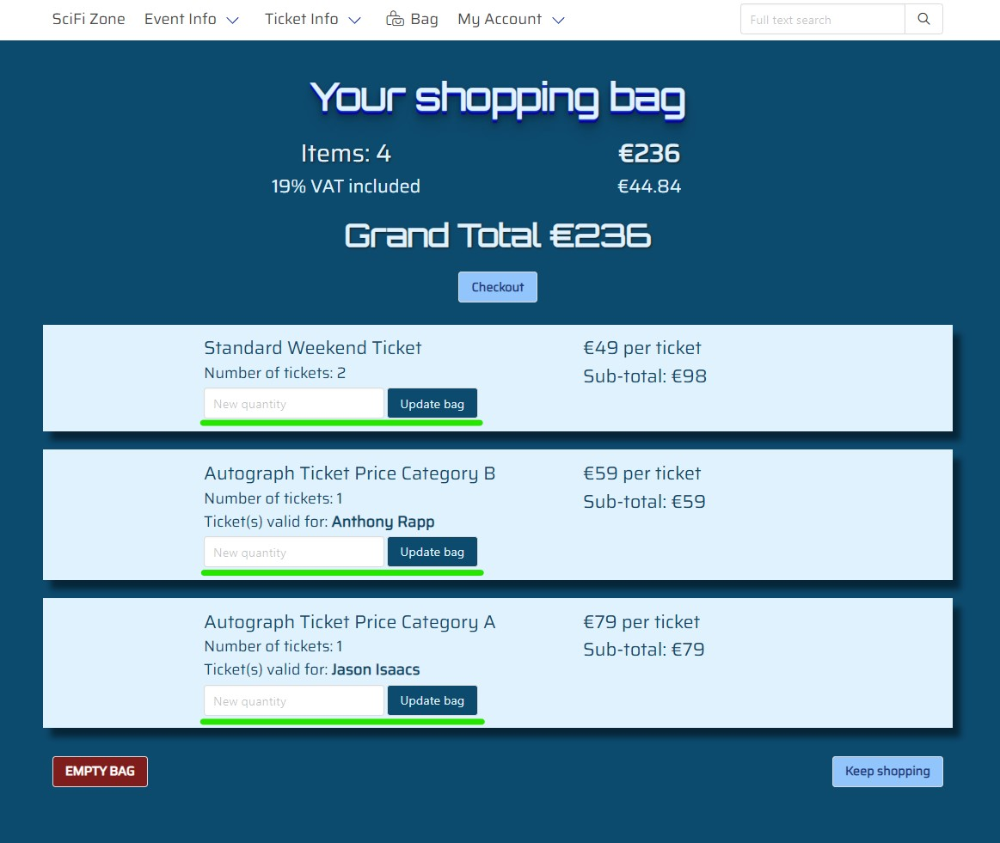

#### **Expectation 12: being able to easily enter payment information**

-   Requirement: Provide an intuitive way for users to enter their payment information
-   Implementation: the [Stripe card element](documentation/testing/usertests/user-expectation-12.jpg) was used for checkout and styled to match the site's theme.

#### **Expectation 13: being able to feel that the personal and payment information is safe and secure**

-   Requirement: Using Django middleware and additional tools like Django-CSP and Django-CORS to make the site as secure as possible. Using Stripe to handle payments, so that the user's payment information never touches the application's server.
-   Implementation: see requirement.

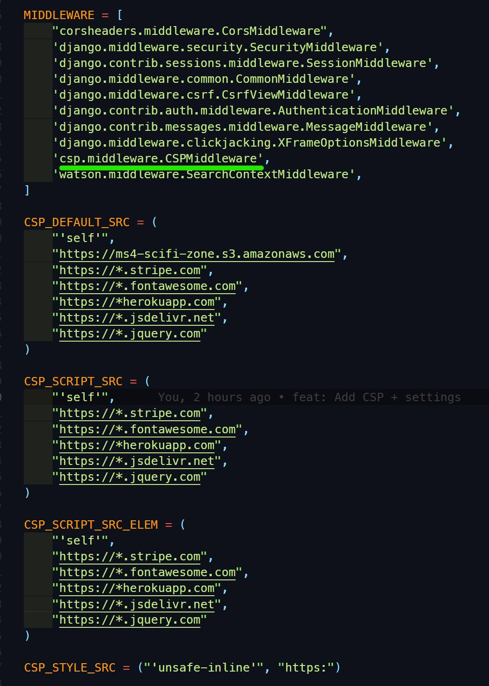

#### **Expectation 14: being able to view an order summary before checkout**

-   Requirement: Use bag tools and contexts to calculate the sub-total, update the bag content, if applicable, and make the contents available on all pages.
-   Implementation: Views and a template to display bag contents using bag tools and contexts were created to display the order summary on the checkout page. See an example [here](documentation/testing/usertests/user-expectation-14.jpg).

#### **Expectation 15: receiving an email confirmation after checkout**

-   Requirement: Collect the user's email address, attach it to the order, and send a confirmation email after a successful checkout.
-   Implementation: The checkout view handles the business logic and generates an [order confirmation on screen](documentation/testing/usertests/user-expectation-15.jpg) after a successful checkout. The built-in Django functionality is used to send a [confirmation email](documentation/testing/usertests/user-expectation-15-example-2.jpg) to the user.

#### **Expectations 16-18**

Please note that for the following three expectations, an adjustment has been made! The expectations cover CRUD functionality for tickets. During the development process, I realized that all kinds of tickets for convention events (entrance tickets, autograph and photoshoot tickets, and combinations of them) are already implemented. I therefore decided to allow admins to add, edit, and delete actors to/from the event instead.

#### **Expectation 16: being able as a site owner to add actors to the event**

-   Requirement: check whether the user has admin privileges, create a form from the corresponding model, and let the authorized user update the database with the data for the new actor.
-   Implementation: A corresponding form, view, url, template, and navbar-item were generated. The view has a login-required decorator and checks whether the user is also a superuser. The navbar-item is only visible for superusers. See these screenshots for the [form](documentation/testing/usertests/user-expectation-16.jpg), [detail page with confirmation dialogue](documentation/testing/usertests/user-expectation-16-example-2.jpg), and [updated guests page](documentation/testing/usertests/user-expectation-16-example-3.jpg).

#### **Expectation 17: being able as a site owner to edit an actor's information**

-   Requirement: similar to the above requirement. Provide a form, accessible only for superusers, to update the information and update the database.
-   Implementation: Links to the form to edit an actor's information are available for superusers both on the guests page and on the detail page for each guest. See screenshots [1](documentation/testing/usertests/user-expectation-17.jpg), [2](documentation/testing/usertests/user-expectation-17-example-2.jpg), [3](documentation/testing/usertests/user-expectation-17-example-3.jpg), and [4](documentation/testing/usertests/user-expectation-17-example-4.jpg).

#### **Expectation 18: being able as a site owner to remove an actor from the convention**

-   Requirement: access the corresponding object and remove it from the database
-   Implementation: Links to remove an actor were placed beneath the links to edit the actor's info. Only Superusers can access the links. After the actor has been removed from the database, the admin is redirected to the [updated guests page](documentation/testing/usertests/user-expectation-18.jpg) and a confirmation message is displayed.

## **Functionality Testing**

---

---

### **Automated tests**

Pytest was used to create automated tests. To ensure DRY was being followed, various fixtures were created in conftest.py and added as parameters to tests where appropriate. Additionally, parametrized testing was used when possible. Please note that I kept the number of tests for checking that pages render as expected intentionally small. All my standard tests for views use the reverse function, check the status code, and ( non-parametrized) tests check that the page contains one defining element for that page. This single test should be more than enough to confirm that the page works as expected, while also ensuring that testing can be done quickly and efficiently, and calls to the database can be kept at a minimum.

**Examples for @pytest.fixture in conftest.py**

**Parametrized testing**

**Concise view test**

Tests for all views and some tests for forms and models were created and either passed or were expected to fail and did so. **However, after [additional security measures](https://github.com/Ryagg/scifi_zone/blob/main/scifi_zone/settings.py#L59-L128) for the project were implemented, most tests failed. A new branch 'run-tests' without the additional security measures has been created, and when this branch is manually deployed, all tests pass again.** With the hard deadline for submission approaching, I unfortunately could not research how to adjust the tests for these additional security settings.

The results for my apps can be found below. XFAIL means that the test is expected to fail and did indeed fail:

**Bag:**

**Checkout:**

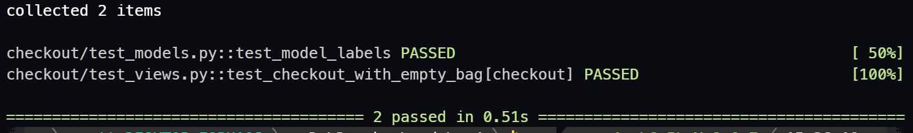

**Find:**

**Guests:**

**Home:**

**Profiles:**

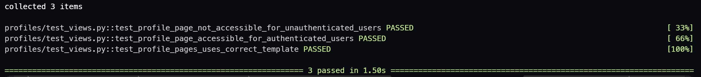

**Tickets:**

I ran into another problem with pytest-cov and coverage. The reported numbers were either suspiciously high (80%, using coverage) or abysmally low (35%, using pytest-cov). Several attempts to exclude files like **init**.py and (almost) empty files (e.g. admin.py in the home app) both via the CLI and in the .coveragerc file were unsuccessful.

**Coverage report:**

## 

### **Manual tests**

#### **Security and defensive design**

**Plan**

Provide as much security for my users and their data, as well as the site itself as possible. Measures taken include: a content security policy, the definition of CORS and CSRF allowed origins, forcing cookies over HTTPS, enabling secure SSL redirect, adding a strict-transport-security header, and - for completeness - forcing subdomains to use SSL. For defensive design, both session cookies and decorators are used to prevent unauthorized access.

**Test**

Try to access the profile page without being logged in. Try to access the checkout page while the bag is empty. Try to access the add guest page without admin privileges.

**Result**

Trying to access the profile page results in a redirect to the login page.

Trying to access the checkout page while the bag is empty results in a redirect to the tickets page and an error message that the bag is empty.

Trying to access the add guest page without admin privileges results in an error message informing the user that he/she doesn't have permission to add guests.

Trying to access the add guest page without being logged in results in a redirect to the login page.

While testing browser compatibility, I noticed that my CSP settings caused console errors on Edge, Firefox, and Opera. At first, I tried to update my settings. The number of errors went down, but there still remained errors. I therefore removed the CSP.

**Verdict**

&#9989; Working as intended.

---

#### **Navbar and footer**

**Plan**

Make the site easy to navigate by providing a fixed-top navbar and drop-down menus for grouped content. Display copyright info, social media links, and links to the site notice and privacy policy in the footer.

**Test**

Access all pages from each page on the navbar and footer.

**Result**

The navbar and footer are visible on all pages except the error pages. This is intentional. Drop-down menus appear when hovered over or activated through the Tab key. All links redirect to the expected page. The social media links open the correspondent pages in a new tab.

**Verdict**

&#9989; Working as intended.

---

#### **Search function**

**Plan**

Allow the user to perform full text search for data within the actor and tickets model (packages are included in the tickets model) and display links to the results. For convenience, the search bar is integrated into the navbar.

**Test**

I started searches for ticket categories, words from the guest detail page, and words that would not be found.

**Result**

All searches returned the expected result.

**Verdict**

&#9989; Working as intended.

---

#### **Home page: event info with CTA**

**Plan**

The home page provides the user with relevant information about the convention. Convention guests are prominently featured to pique users' interest. A prominent link invites users to buy tickets.

**Test**

Each time I visited the page, I wished I could actually buy tickets for the event ;-)

**Result**

The page provides information to motivate users to find out more and/or buy tickets. The CTA button redirects to the tickets page.

**Verdict**

&#9989; Working as intended.

---

#### **Guests page**

**Plan**

Provide the user with an overview of all attending guests. Let users sort guests by categories like series, IP (e.g. Star Trek or Marvel), and films.

**Test**

Visit the page and test the links

**Result**

Currently, the page displays a short introductory paragraph, and photos for all attending guests, with links to the corresponding detail page for each guest. Due to data about series, IP, and movies not being present in the fixture, the sorting function has not yet been implemented.

**Verdict**

&#9989; Working as intended in its current form, but sorting feature not yet implemented.

---

#### **Guest detail page**

**Plan**

Provide information about the guest's scifi related roles and roles outside of scifi. Provide links to the IMDb and Wikipedia entries for the guest, and, if there is one, the official homepage. Let users know how much an autograph and a photoshoot ticket for the guest will cost, and let users add tickets to their shopping bag.

**Test**

Click the links for the IMDb and Wikipedia entries. Add first one autograph and one photoshoot ticket to the bag, then add two more tickets of each category to the bag.

**Result**

The links to external pages open in a new tab and link to the correct entry for the guest. Tickets can be added to the shopping bag, and a message informs the user that either a ticket has been added to the bag or that the number of tickets has been updated.

**Verdict**

&#9989; Working as intended.

---

#### **Tickets and packages pages**

**Plan**

Provide a short explanation about tickets or packages, respectively, and display the price for each type of ticket/package. Provide links to the detail page for each type of ticket/package. Provide links to the opposite category.

**Test**

Check prices for each product against its value in the fixture. Test links.

**Result**

Users are provided with the most relevant information about tickets vs. packages, and can see the price for each product and the price range in a category. A convenient link brings them to the opposite category (ticket vs. package).

**Verdict**

&#9989; Working as intended.

---

#### **Ticket and package detail pages**

**Plan**

Display detailed information about the ticket/package. For autograph and photoshoot tickets, let users choose for which actor the ticket will be valid, and inform them (again) that these tickets are only valid in combination with either any standard ticket or a package. Let users add tickets/packages to the shopping bag. Provide links back to the tickets and packages pages.

**Test**

Test links on the page. Add tickets to the shopping bag. For autograph and photoshoot tickets, try to add a ticket to the shopping bag without selecting a guest.

**Result**

All links work. Adding tickets to the shopping bags results in a confirmation message, and users stay on the page so they can either buy more tickets of the same category, but with another guest selected for add-on-tickets, or use the provide link to return to either the tickets or packages page. Trying to add an add-on-ticket without selecting a guest results in a popup message informing the user that a selection must be made.

**Verdict**

&#9989; Working as intended.

---

#### **Bag page**

**Plan**

Provide users with a detailed overview of their shopping bag contents. Allow users to change the quantity for each item in the bag, remove each item separately, or remove all items from the bag at once. Provide links to either continue to checkout or keep shopping. If users access the bag page, while there are no items in the bag, display a message.

**Test**

Access the page while there are no items in the bag. Put items in the bag and access it again. Change the quantity for packages, standard, autograph and photoshoot tickets. Try to enter negative numbers. Remove items from the bag. Empty the bag. Put items back in and proceed to checkout.

**Result**

Accessing the bag while there are no items in the bag informs the user that the bag is empty and a link to the tickets page is provided.

Changing the quantity for packages and standard tickets correctly updates the bag and displays a confirmation message.

Changing the quantity for autographs or photoshoot tickets for an actor resulted in the number for the ticket category being updated to the new value. The display of the actor for whom the ticket is valid had been implemented after the bag functionality was tested, and I didn't think to test it again after adding the new feature. (Won't make that mistake again...) After updating the view and the template, updating these tickets works as expected.

Trying to enter negative numbers for any type of ticket results in a notification to only enter positive numbers.

Removing packages and tickets correctly removes the items and displays a confirmation message.

Removing autograph or photoshoot tickets for an actor resulted in all tickets from that category being removed from the bag. Again, I didn't check this functionality after adding the display of the actor for whom the ticket is valid. I didn't succeed in updating the view or creating a new view to achieve the desired result, and had to use JavaScript to remove these tickets from the bag. I was unable to generate a confirmation message and therefore can't show a screenshot for this functionality.

Update: While checking browser compatibility, I noticed that this feature once again didn't work. Furthermore, even in Chrome, clicking the button again removed all tickets from that category. I have no explanation for this. On the one hand, I can't imagine that I didn't notice that all items were removed when I tested my 'fix' the day before. On the other hand, I didn't touch the code afterwards. I therefore removed the 'Remove' button. While not optimal, users can still remove items separately by setting the quantity for that item to 0. Please note that I updated the bag screenshots for the Testing User Stories section, but left the screenshots here unchanged to show the difference. I've added an updated screenshot after I removed the 'Remove' button to show that it now works as intended, including a confirmation message for the user and tickets from price category B still in the bag after I removed one ticket for one actor from this price category.

Emptying the bag works as expected and displays a confirmation message.

Clicking on the checkout button redirects to the checkout page and displays the order summary.

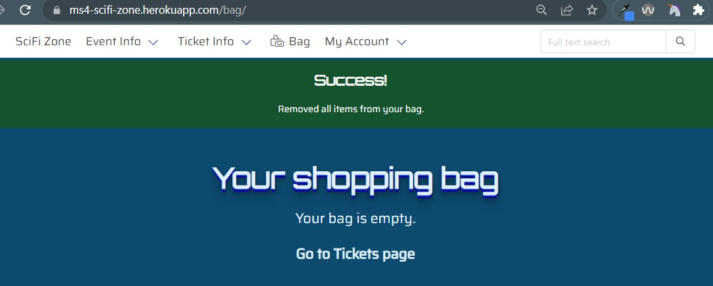

**Verdict**

&#9989; Working as intended after some last-minute bug-fixes

---

#### **Checkout page**

**Plan**

Display the order summary, let users enter their billing address. Allow users to save this data for future purchases. Prefill the form if the address is already in the profile. Handle payment through Stripe.

**Test**

Try to access the site by manually entering the address. Go there from the bag page. Try to checkout without filling out the form. Fill out the form and enter the credit card number.

**Result**

Trying to access the page by manually entering the address results in an error message and redirects to the tickets page.

Trying to submit the payment without filling out the form leads to a notification to fill out the first required input field without data.

Trying to submit the payment with incomplete payment data results in an error message on the card element provided by Stripe.

Submitting the payment with a valid form and valid payment data redirects to the checkout success page.

**Verdict**

&#9989; Working as intended.

---

#### **Checkout success page**

**Plan**

Display the order confirmation and order number to the user. Provide a brief order summary and display the grand_total. Inform the user that a confirmation email will be sent to the provided email address.

**Test**

Complete the checkout process.

**Result**

See screenshot above.

**Verdict**

&#9989; Working as intended.

---

#### **Profile page**

**Plan**

Let users enter or update their billing address. Display the order history or inform the user that no orders have been placed yet, and provide a link to the tickets page.

**Test**

Try to access the page while not logged in. Access the page while logged in. Update the billing address.

**Result**

Accessing the page while not logged in redirects to the login page.

Accessing the page while logged in correctly displays the billing address form with data the user has already entered, or displays an empty form on the first visit.

Updating the billing address shows the new info in the form and displays a confirmation message.

For users who already ordered tickets, the order history for each order is displayed.

**Verdict**

&#9989; Working as intended.

---

#### **Admin action: add guest**

**Plan**

Allow admins to add new guests to the convention, and edit or delete existing entries.

**Test**

Try to access the page while not being logged in. Try to access the page without admin privileges. Access the site as admin. Try to submit an empty form. Try to submit an invalid form. Add a new guest, edit the entry, then delete the entry.

**Result**

Trying to access the page while not being logged in redirects to the login page.

Trying to access the page without admin privileges results in an error message.

Accessing the page as admin displays the form. Required fields have an asterisk at the end of the placeholder. For the autograph and photoshoot categories, the required format is shown as additional placeholder text.

Trying to submit an empty form displays a notification to fill out the first required field without data.

To ensure that the price for the autograph and photoshoot tickets will be displayed correctly, I added regex validation to the actor model. Not adhering to the required format results in an error message, and the offending entries are marked.

The test results for adding a new guest, and for editing + deleting an existing entry can be found in the testing user stories 16 - 18 section [here](https://github.com/Ryagg/scifi_zone/blob/main/TESTING.md#expectation-16-being-able-as-a-site-owner-to-add-actors-to-the-event).

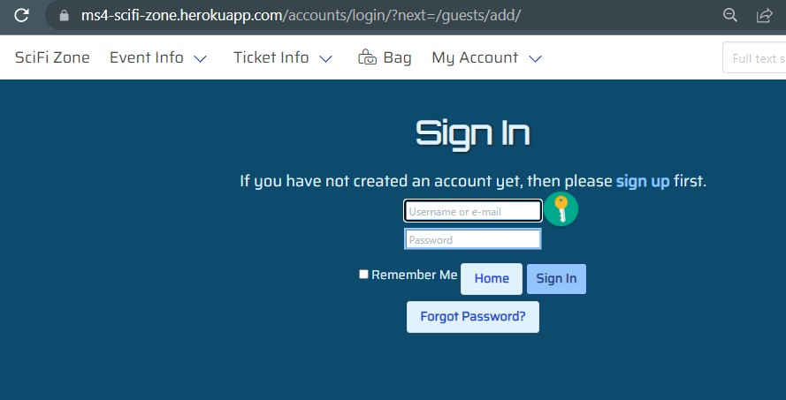

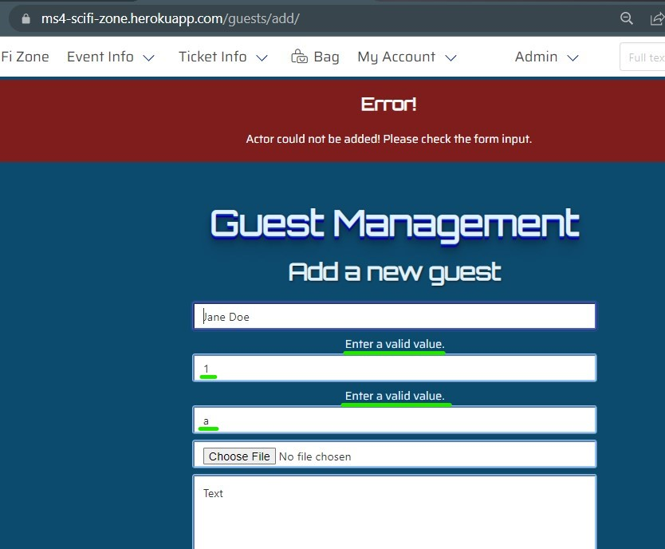

**Verdict**

&#9989; Working as intended.

---

## **Validators**

---

---

### **W3C Markup Validator**

---

For validating my HTML code, at first the source code from each page of the generated live site was first copied and pasted into the validator on [W3C Markup Validation Service](https://validator.w3.org/). At first, several errors, e.g. regarding labels and missing closing tags, were reported. These errors have been fixed and the tests repeated. The last test runs were done using 'Check by address' for all pages except the bag, checkout, checkout success page, and add guest page. For these, the source code was used. For the add guest page, I was logged in with admin-privileges. The results are presented below:

**Result for homepage:**

-   No errors reported. Two warnings.

**Result for guests page:**

-   No errors or warnings reported.

**Result for timetable page:**

-   No errors or warnings reported.

**Result for tickets page:**

-   No errors or warnings reported.

**Result for ticket details page** (Photoshoot category A exemplary for all ticket details pages)

-   No errors or warnings reported after several fixes.

**Result for packages page:**

-   No errors or warnings reported.

**Result for package details page** (diamond package exemplary for all packages):

-   No errors or warnings reported after several fixes.

**Result for bag page**

-   No errors or warnings reported after several fixes.

**Result for checkout page**

-   No errors reported. Three warnings.

**Result for checkout success page**

-   No errors or warnings reported.

**Result for profile page**

-   No errors or warnings reported.

**Result for add guest page**

-   No errors or warnings reported after loads of fixes and with the help of my mentor, Tim Nelson.

**Result for site notice page**

-   No errors or warnings reported.

**Result for privacy policy page**

-   No errors or warnings reported.

### **W3C CSS Validator**

---

The [W3C CSS Validation Service](https://jigsaw.w3.org/css-validator/) reported no errors when using 'Validate by direct input'. 34 warnings were reported due to vendor extensions. Using 'Validate by URI' leads to 9 errors. All those errors are from the bulma.min.css file. 259 warnings are reported in total. 12 warnings are for vendor extensions from my css-file, and the rest for vendor extensions from the bulma.min.css-file.

### **WAVE Validator**

---

The [web accessibility evaluation tool](https://wave.webaim.org/) was used to check the site's accessibility features.

-   **Homepage:**

    All three alerts are caused by short paragraphs that to Wave appear to be headings.

    
    

---

-   **Guests page:**

    No errors or alerts reported.

    

---

-   **Guest detail page** (Jason Isaacs exemplary for all guest details pages):

    Both alerts are caused by short paragraphs that to Wave appear to be headings.

    
    

---

-   **Timetable page:**

    No errors or alerts reported.

---

-   **Tickets page:**

    Both alerts are caused by short paragraphs that to Wave appear to be headings.

    
    

---

-   **Ticket details page** (Autograph Ticket Price Category B including radio elements exemplary for all ticket details pages):

    No errors or alerts reported.

    

---

-   **Packages page:**

    One caused by a short paragraph that to Wave appears to be a heading.

    
    

---

-   **Package details page** (Diamond package exemplary for all packages):

    No errors or alerts reported.

    

---

-   **Registration page:**

    One alert due to an redundant link.

    

---

-   **Login page:**

    No errors or alerts reported.

    
    

---

-   **Profile page:**

    Following the approach from the Boutique Ado walk-through, the labels for all form inputs were removed, and the content placed as placeholder text inside the input fields. This causes errors due to missing form labels on all pages including forms. For this page, 5 missing form labels and 1 missing select label are reported. Additionally, 3 alerts due to possible headings are reported.

    
    

---

-   **Add guest page:**

    Ten errors due to missing form labels are reported.

    

---

-   **Logout page:**

    No errors or alerts reported.

    

---

-   **Site notice page:**

    All alerts are caused by short paragraphs that to Wave appear to be a heading.

    

---

-   **Privacy policy:**

    No errors or alerts reported.

    

---

### **Lighthouse**

---

The results for both the mobile version and the desktop version are displayed. For the mobile version, the performance is lower than I'd prefer. The main factors are render-blocking resources (mainly bulma.min.css, jquery-3.6.0.min.js, base.css, and base.js) and are for the most part (external sources) outside of my control.

Please note that I only checked pages created by me.

-   **Homepage:**

**homepage-mobile:**

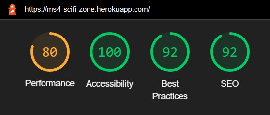

**homepage-desktop:**

-   **Guests page:**

**guests-mobile:**

**guests-desktop**:

-   **Timetable page:**

**timetable-mobile:**

**timetable-desktop:**

-   **Tickets page:**

**tickets-mobile:**

**tickets-desktop:**

-   **Tickets detail page** (Autograph ticket price category B exemplary for all ticket details pages):

**ticket_detail-mobile:**

**ticket_detail-desktop:**

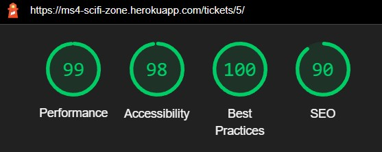

-   **Packages page:**

**packages-mobile:**

**packages-desktop**:

-   **Package detail page** (Diamond package exemplary for all package detail pages):

**package_detail-mobile:**

**package_detail-desktop:**

-   **Bag page:**

**bag-mobile:**

**bag-desktop:**

-   **Checkout page:**

**checkout-mobile:**

The performance for this page is very poor. Render-blocking resources cost 2.27 seconds, the total blocking time is 700ms, and both the first contentful paint with 3.7 seconds, and the largest contentful paint with 4.2 seconds take too long. I have no explanation for the huge discrepancy compared to the results for the desktop version below.

**checkout-desktop:**

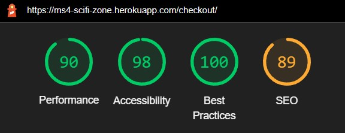

-   **Checkout success page:**

**checkout-success_mobile:**

**checkout-success-desktop:**

-   **Profile page:**

**profile-mobile:**

**profile-desktop:**

-   **Add guest page:**

**add-guest_mobile:**

**add-guest_desktop:**

-   **Site notice page:**

**site-notice_mobile:**

**site-notice_desktop:**

-   **Privacy policy page:**

**privacy-policy_mobile:**

**privacy-policy_desktop:**

### **JShint**

---

No errors were reported for base.js, stripe_elements.js or the script in bag.html using [JSHint](https://jshint.com/).

### **Python**

---

Each .py-file has been formatted using the autopep8-extension for VSCode with the parameters '--max-line-length 79 --in-place --aggressive --aggressive' to guarantee PEP8-compliance. No errors have been reported by pylint.

## **Usability Testing**

---

---

Family, friends and colleagues were asked to test the site on their computers and/or mobile devices and their preferred browsers. The first page load can sometimes take very long. This happens when the app is 'asleep'. This is a limitation of the free Heroku account. No issues regarding the navigation of the site were reported. Feedback regarding the style of the CTA button on the homepage and the 'Add to shopping bag' buttons on the actor/ticket/package detail pages has been taken into account. The buttons now match the style of the buttons from the register and login pages. Feedback regarding readability due to poor contrast has also been taken into account as well, and the text colour for disclaimers has been adjusted to the default colour, and a red border has been added. No other issues were reported.

## **Compatibility Testing**

---

---

My CSP caused multiple console errors in Edge, Firefox, and Opera. Adjusting the CSP settings did not fully resolve this issue. Unfortunately, I had no other choice but to remove my CSP completely. But user experience and no console errors are more important than stroking my ego with the implementation of a feature.

Opera and Edge do not load the specified fonts and use fall-back system fonts. I did not use the usual font import to comply with a German Court ruling regarding to embedding Google Fonts and GDPR. Instead, I host the fonts in my AWS S3 bucket. Interestingly, when I had my CSP still in place, I could see in the console that attempted font downloads from Google static were prevented. Currently, I don't see any notifications in the console at all. While Opera and Edge users can't see the intended fonts, they profit from an improved critical rendering path due to the fonts not being downloaded. I don't know why Firefox picks up the fonts, and Edge and Opera don't.

**Update May, 22nd, 2022:**
After adding additional CSP settings (CSP_FONT_SRC, CSP_FRAME_SRC, CSP_CONNECT_SRC, CSP_IMAGE_SRC, and CSP_INCLUDE_NONCE_IN) as well as adding several entries, e.g. checkout subpages, to the relevant categories the console errors in Edge, Firefox, and Opera have been fixed. All fonts are loaded correctly and the application can be used in Chrome, Edge, Firefox, and Opera without limitations. Some of the mentioned changes were found at https://www.laac.dev/blog/content-security-policy-using-django/.

All screenshots so far have been created in Chrome. Therefore, only screenshots from Edge, Firefox, and Opera are included below.

### **Microsoft Edge**

-   In Edge, on the ticket detail page for autograph or photoshoot tickets, at one point the content shifted when hovering over the actors' names for some viewports. A few hours later, I couldn't reproduce this bug. In between, I removed the CSP and fixed a bug on the bag page, but didn't change the template or view for the ticket detail page.

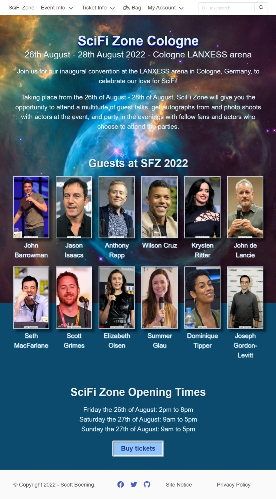

**Please note that the card element on the actual page is rendered without the white highlighting!**

### **Firefox**

### **Opera**

**Please note that the area without the background image was out of view while the screenshot was taken!**

**Please note that the card element is rendered correctly on the actual page!**

## **Responsiveness**

---

---

To test responsiveness, I used Google Chrome Developer Tools and Sizzy. Several problems could be identified and corrected, e.g. https://github.com/Ryagg/scifi_zone/commit/2241f748c2b2963ba7e46a47f00a220ae7ef11ba. For the remaining bugs, please refer to the Bugs section below. Apart from that, the site content is displayed correctly on all viewports.

## **Bugs**

---

---

### **Fixed bugs**

For 'normal' fixed bugs, please refer to commits with the prefix 'fix'. During development, I encountered several issues that caused me much trouble and took much trial and error, and many commits, before I could finally fix them. They are described in detail below.

#### **Implementing the search function across multiple models**

While I have integrated both tickets and packages into the tickets app, they use different models and templates. In my views, I therefore use filters to select only tickets or packages for the respective view, and each view has its own template.

Changing a view to select all objects from the Ticket class for the search and only display tickets or packages in the template worked. But for the search result display, I had to include if-statements to check whether the result referred to a ticket or a package. I didn't like the approach. I felt it was overly complicated. Furthermore, this led to 'NoReverseMatch'-errors, because my detail pages for tickets use the request and the tickets_id as parameters, while my detail pages for packages need an additional parameter package_name.

This led me to Django-Watson, which enabled me to register each model I want to be included for my search results. I had to heavily customize the search_results template. Obviously, it didn't match my site's styling. And, for some reason I don't understand, the result display links back to the search query.

Using [SQLite](https://marketplace.visualstudio.com/items?itemName=alexcvzz.vscode-sqlite), I found that tickets and packages have the content_type_id 15 in the watson_searchentry table, and actors use the content_type_id 17. With this information, I could modify the template and let the search results for actors, tickets, and packages each link to the corresponding page using the correct template. I happily committed and pushed the code to my repo.

To my utter dismay, my deployed site displayed an almost 'naked' site for the search results and the links linked back to the search query. I soon realized that I had styled and modified the search_results template inside my virtual environment, and that this file, of course, had not been part of my commit. So I had to find a way to make Watson use my customized template. Placing the file in my projects root directory, the project-level template directory, and inside the base template didn't work. Creating a custom context-processor to make it available didn't work, because I failed to access the watson search results. Trying to use the template in one of my existing views failed.

I got the search function to work and use my customized template by creating a new app, importing Watson, and copying my template inside the app. And still, the problems didn't end... The search suddenly didn't find any results. I realized that the content_type_id values must differ in the PostgreSQL database. But I didn't know how to access these values. So I changed my logic to check result.title instead of content_type_id. This succeeded insofar as now search results were found again. But now results for tickets and packages linked to the ticket detail page, so that packages were displayed with the wrong template.

I found a way to access the PostgreSQL database with [PostgreSQL](https://marketplace.visualstudio.com/items?itemName=ckolkman.vscode-postgres). This showed me that in this database tickets and packages have the content_type_id 14, and actors have the content_type_id 16. Now I was able to check both for the content_type_id and whether result.title included either "Ticket" or "Package" and use the correct template for each type of object.

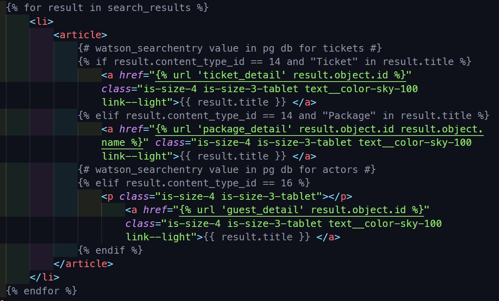

At long last, the search function works as intended!

#### **Placeholder attribute on a file input field**

The form to add a new guest to the convention includes a file input field. The functionality to add guests and images to the site always worked. When validating my code, the validator showed an error because I had put a placeholder on the file input field. I thought this would be an easy fix. How wrong I was...

The reason for many commits for this bug is that I had by that time enabled additional security measures which didn't allow local testing due to enforced HTTPS. Disabling these settings temporarily in my settings.py didn't (seem to) work. I still could not test my potential fixes locally. So I had to 'fly blind' and commit my changes, and then test whether they worked... I managed to introduce more bugs. My stress levels kept rising. The hard deadline was approaching, and not being able to fix this error would cause an automatic failure.

At one point, I managed to remove the HTML error. But then all placeholder text for the required fields was gone, too. It seemed like I could have either visible placeholders on the required fields, and the HTML error and the resulting automatic failure for my project. Or no HTML error, but also no placeholder text for the required fields, which perhaps would not have caused a failure, but a serious markdown.

Having calmed down a bit, I found that I couldn't test my changes locally, even with the additional security settings commented out because I hadn't cleared my browsing data. So after clearing the browser data, I could test my potential fixes before committing them. And the suggestion from my mentor, Tim Nelson, to set the attributes for each field separately, finally did the trick!

I have always been thorough in my manual testing procedures and code validation. I knew that to validate the code for this page, I couldn't use 'validate by URI', because then only the redirect for users not in session would have been tested. Only logging in as an admin and then using the source code for 'validate by direct input' allowed me to spot this error and, in the end, fix it. This episode has further strengthened my resolve to continue thoroughly testing my code for future projects. As an optimization, I will also integrate code validation before committing into my workflow.

#### **Changing the quantity for autograph or photoshoot tickets for selected actors**

When I implemented the bag functionality and the display of bag contents, it didn't include the actor for whom the ticket is valid. So, both 3 autograph tickets for one actor, and three autograph tickets for three different actors from the same price category were displayed as three autograph tickets for the price category <price_category>. At this point, both changing the quantity by inputting a number, and removing tickets by clicking the 'Remove' button worked flawlessly.

I later decided that it would be nice to display the names of the actors for whom the tickets are valid. So I updated the template. Everything looked fine. And I didn't think to test whether this affected the bag functionality. Huge mistake.

When I did the functionality tests for the bag page, I noticed that both changing the quantity of an autograph or photoshoot ticket for one actor, and removing an autograph or photoshoot ticket for one actor, affected all tickets from that category.

Adjusting the view and template fixed the bug for changing the quantity by input. But clicking the 'Remove' button still affected all tickets from that category. To fix this, I had to use the JavaScript from the Boutique Ado walk-through to remove items from the bag. The functionality now works as intended, except for a missing confirmation message to the user. See the section remaining bugs below.

While checking compatibility, the button again removed all tickets from the corresponding category... In the end, I removed the button completely. To remove an item from the bag, users now must enter 0 as new quantity. While not optimal, it sure beats users accidentally removing all items from a category when they only want to remove a single item from that category.

Lesson learned: **always** check functionality after adding new features!

### **Remaining bugs**

-   When logged in as an admin, the search bar input field causes overflow for some viewports, and the navbar items are not centred for viewports from 1024px to 1215px.

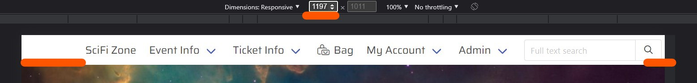

-   For all viewports the country select label on the checkout page is longer than the other input fields.

-   For viewports with 320px, the heading 'Billing address' doesn't fit.

-   Hovering over the checkbox on the login page causes the text next to it to use the Bulma default for hover and become difficult to read due to poor contrast

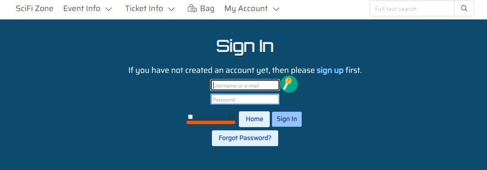
